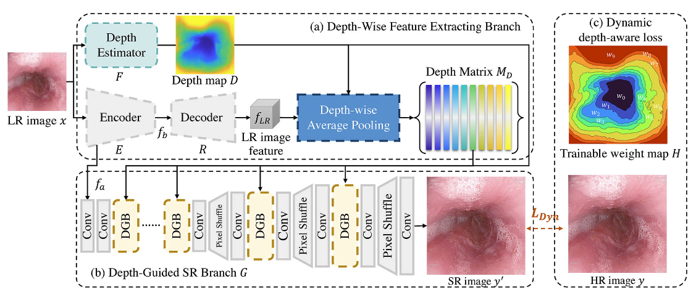
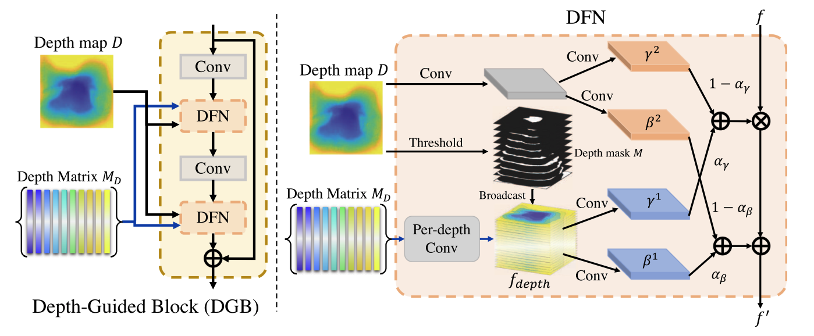

# Depth-Aware-Endoscopy-SR
This repository is an official PyTorch implementation of the paper "<strong>Dynamic Depth-Aware Network for Endoscopy Super-Resolution</strong>"[<a href="https://ieeexplore.ieee.org/stamp/stamp.jsp?tp=&arnumber=9815859">paper</a>] from JBHI 2022
<p align="center">

</p>
<p align="center" style="margin-top:-16px">

</p>

## Environment
Please follow the `requirements.txt`

## Dataset
In this work, we use the Kvasir and the EndoScene datasets. <br>
1. We provide the HR and LR images (factor=8) for the Kvasir dataset, which can be downloaded from <a href="https://drive.google.com/drive/folders/1bNSU7gLwkxDxjLI449XAyBSEfF6btoOD?usp=sharing">google drive</a>. This includes the GT depth map of LR imaiges (LR_depth.targ.gz). For the factor = 2 or 4, please manually downscale the HR images according to the target factor. <br>
2. To download EndoScene dataset, please see <a href="https://polyp.grand-challenge.org/CVCClinicDB/">here</a>. The corresponding depth maps for LR images can be obtained through the following depth estimation part to predict depth maps.<br>


## Training & Testing Model
Here, we give an example to train the SR model for x8 Kvasir dataset.
1. Configuration: <br>
 Please modify the data path `dataroot_GT`, `dataroot_LQ`, `dataroot_depthMap` in `codes/options/train/train_depthNet_SEAN_depthMask_x8.yml` <br>
2. Training: <br>
```
sh ./launch/train.sh
```
3. Testing: <br>
Please modify the model and data path `pretrain_model_G`, `dataroot_GT`, `dataroot_LQ`, `dataroot_depthMap` in `codes/options/test/test_depthNet.yml` <br>
```
sh ./launch/test.sh
```
## Depth Estimation
Here, we pre-trained a depth estimator based on <a href="https://github.com/nianticlabs/monodepth2">monodepth2</a> and use this model to generate the depth map as ground-truth depth map for our proposed method.<br>
Please download the <a href="https://drive.google.com/drive/folders/1bNSU7gLwkxDxjLI449XAyBSEfF6btoOD?usp=sharing">pre-trained model</a>, unzip `weights_19.tar.gz` and place it to `./codes/depth_estimation/pretrained_models/weights_19`
```
cd ./codes/depth_estimation
```
Please provide `--image_path data_root/img_path` in `./launch/test.sh`<br>
Run the following command to obtain the depth maps:
```
sh ./launch/test.sh
```


## Cite
If you find our work useful in your research or publication, please cite our work:
```
@article{chen2022dynamic,
  title={Dynamic depth-aware network for endoscopy super-resolution},
  author={Chen, Wenting and Liu, Yifan and Hu, Jiancong and Yuan, Yixuan},
  journal={IEEE Journal of Biomedical and Health Informatics},
  volume={26},
  number={10},
  pages={5189--5200},
  year={2022},
  publisher={IEEE}
}
```

## Contact
Please contact us <a href="wentichen7-c@my.cityu.edu.hk">here</a> if you have any question.